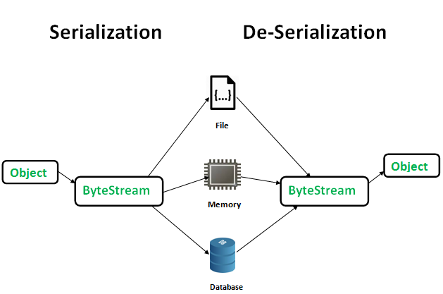
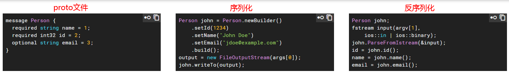

# Protobuf
## 简介
&emsp;&emsp;Google Protocol Buffer( 简称 Protobuf) 是 Google 公司内部的混合语言数据标准，他们用于 RPC 系统和持续数据存储系统。<br/>
&emsp;&emsp;Protocol Buffers 是一种轻便高效的`结构化数据存储格式，可以用于结构化数据串行化，或者说序列化`。它很适合做数据存储或 RPC 数据交换格式。可用于通讯协议、数据存储等领域的语言无关、平台无关、可扩展的序列化结构数据格式。目前提供了 C++、Java、Python 三种语言的 API。<br/>

## 01安装Protobuf
   1. 源码安装Protobuf(https://github.com/protocolbuffers/protobuf/releases)
      1. 网站 http://code.google.com/p/protobuf/downloads/list上可以下载 Protobuf 的源代码,或者是protobuf-2.5.0.tar.gz(已上传到百度云盘，地址： http://pan.baidu.com/s/1pJlZubT)<br/>
      2. 解压缩： tar -zxf protobuf-2.5.0.tar.gz
      3. 进入目录：cd protobuf-2.5.0
      4. 若希望编译成功后输出的目录为/usr/local/protobuf/ 则输入如下两条命令：
         1. ./configure --prefix=/usr/local/protobuf/   # ./configure --prefix=$INSTALL_DIR
         2. make
         3. make check
         4. make install
         5. ldconfig # refresh shared library cache.
         6. 编译成功后将export PATH=/usr/local/protobuf/bin:$PATH加入到环境变量中
         7. 安装后校验：protoc --version命令，如显示libprotoc 2.5.0则安装成功
   2. 直接安装： yum -y install  protobuf-compiler protobuf-static protobuff protobuf-devel

## 02 一个简单的例子
&emsp;&emsp;使用 Protobuf 和 C++ 开发一个十分简单的例子程序，该程序由两部分组成。第一部分被称为 Writer，负责写磁盘，第二部分叫做 Reader负责读磁盘内容，这就实现了最简单的RPC数据交互。<br/>
#### 步骤1：书写 .proto 文件
&emsp;&emsp;proto 文件，定义我们程序中需要处理的结构化数据，在 protobuf 的术语中，结构化数据被称为 Message。proto 文件非常类似 java 或者 C 语言的数据定义，如下：<br/>
```ProtoBuf
package lm;  			//Package Name
message helloworld 		//Message Name
{
	required int32  id = 1;	    //id
	required string str = 2;	//str
	optional int32  op = 3;		//optional file
}
```
&emsp;&emsp;在上例中，package 名字叫做 lm，定义了一个消息 helloworld，该消息有三个成员，类型为 int32 的 id，另一个为类型为 string 的成员 str。opt 是一个可选的成员，即消息中可以不包含该成员。<br/>
#### 步骤2：编译 .proto 文件
&emsp;&emsp;写好 proto 文件之后就可以用 Protobuf 编译器将该文件编译成目标语言了。具体的编译语句为：`protoc -I=$SRC_DIR --cpp_out=$DST_DIR $SRC_DIR/proto_name.proto` <br/>
```ProtoBuf
protoc -I=./ --cpp_out=./ ./conf.proto   #编译proto文件
#待编译的文件为conf.proto，他存放在当前目录下。--cpp_out参数则指示编译工具我们需要生成目标语言是C++，输出目录是当前目录。
#在本例中，生成的目标代码文件名是conf.pb.h和conf.pb.cc。
```
&emsp;&emsp;命令将生成两个文件：conf.pb.cc 和 conf.pb.h,分别定义了C++ 类的实现文件以及其头文件。在生成的头文件中，定义了一个 C++ 类 helloworld，后面的 Writer 和 Reader 将使用这个类来对消息进行操作。诸如对消息的成员进行赋值，将消息序列化等等都有相应的方法。<br/>

#### 步骤3：编写 writer 和 Reader
&emsp;&emsp;如果不采用Protobuf实现的话， 需要让读写者同时了解共享内容的构成，包括分隔符等细节。<br/>
&emsp;&emsp;而采用Protobuf后，需要处理的结构化数据由 .proto 文件描述，经过上一节中的编译过程后，该数据化结构对应了一个 C++ 的类，并定义在 lm.helloworld.pb.h 中。对于本例，类名为 lm::helloworld，它提供了一系列的 get/set 函数用来修改和读取结构化数据中的数据成员，或者叫 field。<br/>
&emsp;&emsp;对于想要读取这个数据的程序来说，也只需要使用类 lm::helloworld 的相应反序列化方法来将这个字节序列重新转换会结构化数据。<br/>

```C++
/*
* Write： 负责把待通信的数据，写到磁盘中
*/

#include <iostream>
#include <fstream>
#include <string>
#include "conf.pb.h"        // 通过对conf.proto文件编译得到的C++类头文件
using namespace std;

int main(void){
    lm::helloworld msg1;    // 定义helloworld 类的对象，set_属性() 用来设置 属性 的值。SerializeToOstream 将对象序列化后写入一个 fstream 流。
    msg1.set_id(100);
    msg1.set_str("hello");

    //write into disck
    fstream output("./log", ios::out | ios::binary);
    if(!msg1.SerializeToOstream(&output)){
        cerr<<"Failed to write msg."<<endl;
        output.close();
        return -1;
    }
    output.close();
    return 0;
}


/*
* Read： 负责把待通信的数据，从磁盘中读出来
*/
#include <iostream>
#include <fstream>
#include <string>
#include "conf.pb.h"            // 通过对conf.proto文件编译得到的C++类头文件
using namespace std;


void ListMsg(const lm::helloworld &msg){    //采用 get 方法读取消息的内部信息，并进行打印输出操作。
   cout<<msg.id()<<endl;
   cout<<msg.str()<<endl;
}

int main(void){
    lm::helloworld msg1;
    fstream input("./log",ios::in | ios::binary);
    if(!msg1.ParseFromIstream(&input)){     //反序列化，生成结构化的数据：helloworld 类的对象
        cerr<<"Failed to parse pb msg."<<endl;
        input.close();
        return -1;
    }
    input.close();
    ListMsg(msg1);
    return 0;
}

```
#### 步骤4：编译运行
```shell script
#编译：
g++ -o write write.cpp conf.pb.cc  -I/usr/local/protobuf/include/ -L/usr/local/protobuf/lib/ -lprotobuf
g++ -o read read.cpp conf.pb.cc  -I/usr/local/protobuf/include/ -L/usr/local/protobuf/lib/ -lprotobuf\n

#运行
./write
./read
```
   - 常见的编译错误：<br/>
      - .proto文件转化成OC文件时：Expected "required", "optional", or "repeated"
         - 原因：因为pb2和pb3的语法不一样，pb3不用在每个参数前加required还是optional，但是pb2是必须要有该参数的。
      - fatal error: google/protobuf/stubs/common.h: No such file or directory
         - 没有找到头文件，使用g++ 的-I 参数：-I/usr/local/protobuf/include/  ,这里就是你安装的路径(上面./configure --prefix=/usr/local/protobuf/)       
      - variable 'std:ofstream' has initializer but incomplete type
         - 原因是因为没有包含fstream这个头文件。在源码中需要  #include <fstream>
      - undefined reference to google protobuf [duplicate]
         - 编译的时候，需要制定protobuf的动态库，-L/usr/local/protobuf/lib/ -lprotobuf
      
## 03 Protobuf的优缺点：
   - Protobuf 的优点：
      - Protobuf 有如 XML，不过它更小、更快、也更简单。
         - 你可以定义自己的数据结构，然后使用代码生成器生成的代码来读写这个数据结构。
         - 你甚至可以在无需重新部署程序的情况下更新数据结构。只需使用 Protobuf 对数据结构进行一次描述，即可利用各种不同语言或从各种不同数据流中对你的结构化数据轻松读写。

      - 对扩展开放：
         - 它有一个非常棒的特性，即“向后”兼容性好，人们不必破坏已部署的、依靠“老”数据格式的程序就可以对数据结构进行升级。
         - 这样您的程序就可以不必担心因为消息结构的改变而造成的大规模的代码重构或者迁移的问题。因为添加新的消息中的 field 并不会引起已经发布的程序的任何改变。

      - Protobuf 语义更清晰
         - 无需类似 XML 解析器的东西（因为 Protobuf 编译器会将 .proto 文件编译生成对应的数据访问类以对 Protobuf 数据进行序列化、反序列化操作）。

      - 使用 Protobuf 无需学习复杂的文档对象模型，Protobuf 的编程模式比较友好，简单易学，同时它拥有良好的文档和示例，对于喜欢简单事物的人们而言，Protobuf 比其他的技术更加有吸引力。<br/>
   - Protobuf 的不足:
      - Protbuf 与 XML 相比也有不足之处。它功能简单，无法用来表示复杂的概念。
      - XML 已经成为多种行业标准的编写工具，Protobuf 只是 Google 公司内部使用的工具，在通用性上还差很多。
      - 由于文本并不适合用来描述数据结构，所以 Protobuf 也不适合用来对基于文本的标记文档（如 HTML）建模。另外，由于 XML 具有某种程度上的自解释性，它可以被人直接读取编辑，在这一点上 Protobuf 不行，它以二进制的方式存储，除非你有 .proto 定义，否则你没法直接读出 Protobuf 的任何内容。         
 
## 04 高级应用话题：  
#### 1. 嵌套 Message
&emsp;&emsp;一旦拥有嵌套能力，消息的表达能力就会非常强大。嵌套实现了复杂json的特性，如下：<br/>
```Protobuf
package lm;  		//Package Name
message person 		//Message Name
{
	required string name = 1; 
	required int32 id = 2;        // Unique ID number for this person. 
 	optional string email = 3; 
 	enum PhoneType { 
   		MOBILE = 0; 
   		HOME = 1; 
   		WORK = 2; 
 	} 
 
 	message PhoneNumber { 
   		required string number = 1; 
   		optional PhoneType type = 2 [default = HOME]; 
 	} 
 	repeated PhoneNumber phone = 4; 
}
```
&emsp;&emsp;在 Message person 中，定义了嵌套消息 PhoneNumber，并用来定义 person 消息中的 phone 域。这使得人们可以定义更加复杂的数据结构。<br/>

#### 2. Import Message
&emsp;&emsp;在一个 .proto 文件中，还可以用 Import 关键字引入在其他 .proto 文件中定义的消息，这可以称做 Import Message，或者 Dependency Message。<br/>
```C++
import common.header; 
 
message youMsg{ 
 required common.info_header header = 1; 
 required string youPrivateData = 2; 
}
```
&emsp;&emsp;其中 ,common.info_header定义在common.header包内。Import Message 的用处主要在于提供了方便的代码管理机制，类似 C 语言中的头文件。您可以将一些公用的 Message 定义在一个 package 中，然后在别的 .proto 文件中引入该 package，进而使用其中的消息定义。<br/>

## 05 高级应用实战 - 嵌套 Message：  
&emsp;&emsp;嵌套Message的举例如下：<br/>
#### 步骤1：书写 .proto 文件
&emsp;&emsp;编写conf.proto文件，person类有属性：name,id，email和phone,其中phone是装有相同元素类型的数组，每个元素都是PhoneNumber<br/>
```ProtoBuf
package lm;  		//Package Name
message person 		//Message Name
{
	required string name = 1; 
	required int32 id = 2;        // Unique ID number for this person. 
 	optional string email = 3; 
 	enum PhoneType { 
   		MOBILE = 0; 
   		HOME = 1; 
   		WORK = 2; 
 	} 
 
 	message PhoneNumber { 
   		required string number = 1; 
   		optional PhoneType type = 2 [default = HOME]; 
 	} 
 	repeated PhoneNumber phone = 4; 
}

```

#### 步骤2：编译 .proto 文件
&emsp;&emsp;写好 proto 文件之后就可以用 Protobuf 编译器将该文件编译成目标语言了。具体的编译语句为：`protoc -I=$SRC_DIR --cpp_out=$DST_DIR $SRC_DIR/proto_name.proto` <br/>
```ProtoBuf
protoc -I=./ --cpp_out=./ ./conf.proto   #编译proto文件
#待编译的文件为conf.proto，他存放在当前目录下。--cpp_out参数则指示编译工具我们需要生成目标语言是C++，输出目录是当前目录。
#在本例中，生成的目标代码文件名是conf.pb.h和conf.pb.cc。
```
&emsp;&emsp;命令将生成两个文件：conf.pb.cc 和 conf.pb.h,分别定义了C++ 类的实现文件以及其头文件。在生成的头文件中，定义了一个 C++ 类 helloworld，后面的 Writer 和 Reader 将使用这个类来对消息进行操作。诸如对消息的成员进行赋值，将消息序列化等等都有相应的方法。<br/>

#### 步骤3：编写 writer 和 Reader
&emsp;&emsp;直接上代码：<br/>

```C++
/*
* Write： 负责把待通信的数据，写到磁盘中
*/

#include <iostream>
#include <fstream>
#include <string>
#include "conf.pb.h"
using namespace std;

int main(void){
    lm::person msg1;
    //msg1.set_name("harvey");  //这里先定义name 还是先定义id无区别(不会导致 结构化数据的序列化和反序列化的失败)
    msg1.set_id(1);
    msg1.set_name("harvey");
    msg1.set_email("2580205897@qq.com");
    
    //联系方式1   
    lm::person::PhoneNumber *phoneNumber = msg1.add_phone();    //这里和基础的不一样，看下proto编译的目标文件conf.pb.h中的定义就知道了
    phoneNumber->set_number("18888888888");
    phoneNumber->set_type(lm::person::MOBILE);                  //这里是枚举类型
    
    //联系方式2
    phoneNumber = msg1.add_phone();                             //再增加一个联系方式
    phoneNumber->set_number("88888888");
    phoneNumber->set_type(lm::person::WORK);
    
    //write into disck
    fstream output("./log", ios::out | ios::binary);
    if(!msg1.SerializeToOstream(&output)){
        cerr<<"Failed to write msg."<<endl;
        output.close();
        return -1;
    }
    output.close();
    return 0;
}


/*
* Read： 负责把待通信的数据，从磁盘中读出来
*/
#include <iostream>
#include <fstream>
#include <string>
#include "conf.pb.h"
using namespace std;


void ListMsg(const lm::person &msg){
   cout<<msg.id()<<endl;            //取出并打印一些基础的数据
   cout<<msg.name()<<endl;
   cout<<msg.id()<<endl;
   cout<<msg.email()<<endl;
   int phone_size = msg.phone_size();   //针对Protobuf中repeated字段，需要先通过  pb对象.属性_size 来获取属性的个数(大小)
   for(int i =0;i<phone_size;i++){      //遍历所有 的 repeated 对象属性
       lm::person::PhoneNumber phone = msg.phone(i);    //取出具体的嵌套的属性对象
       cout<<phone.number()<<endl;                      //最后拿出结果来
       cout<<phone.type()<<endl;
   }
}

int main(void){
    lm::person msg1;
    fstream input("./log",ios::in | ios::binary);
    if(!msg1.ParseFromIstream(&input)){                 //反序列化
        cerr<<"Failed to parse pb msg."<<endl;
        input.close();
        return -1;
    }
    input.close();
    ListMsg(msg1);
    return 0;
}


```
## 06 其他补充内容
#### 01 序列化与反序列化
&emsp;&emsp;将`数据结构或对象`以某种格式转化为`字节流`的过程，称之为`序列化（Serialization）`，目的是把当前的状态保存下来，在需要时复原数据结构或对象（序列化时不包含与对象相关联的函数，所以后面只提数据结构）。反序列化（Deserialization），是序列化的逆过程，读取`字节流`，根据约定的格式协议，`将数据结构复原`。<br/>
&emsp;&emsp;<br/>
   - 代码运行过程中，数据结构和对象位于内存，其中的各项数据成员可能彼此紧邻，也可能分布在并不连续的各个内存区域，比如指针指向的内存块等；
   - 文件中字节是顺序存储的，要想将数据结构保存成文件，就需要把所有的数据成员平铺开（flatten），然后串接在一起；
   - 直接串接可能是不行的，因为字节流中没有天然的`分界`，所以在序列化时需要按照某种约定的格式（协议），以便在反序列化时知道“从哪里到哪里是哪个数据成员”，因此格式可能`需要约定：指代数据成员的标识、起始位置、终止位置、长度、分隔符等`.
   - 由上可见，`格式协议`是最重要的，它直接决定了序列化和反序列化的效率、字节流的大小和可读性等.<br/>
&emsp;&emsp;<br/>
&emsp;&emsp;Protobuf序列化为binary stream，体积更小,但也丧失了可读性。proto文件，在其中定义我们想要序列化的数据结构，如上图中的message Person，通过Protobuf提供的protoc.exe生成编解码代码文件（C++语言是.cc和.h），其中定义了类Person，类的各个成员变量与proto文件中的定义保持一致。序列化时，定义Person对象，对其成员变量赋值，调用序列化成员函数，将对象保存到文件。反序列化时，读入文件，将Person对象复原，读取相应的数据成员。proto文件仅定义了数据的结构（name、id、email），具体的数据内容（1234、"John Doe"、"jdoe@example.com"）保存在序列化生成的文件中，通过简单的思考可知，序列化后的文件里应该会存在一些辅助信息用来将数据内容与数据结构对应起来，以便在反序列化时将数据内容赋值给对应的成员。<br/>

## 07 参考文献
[ProtoBuf Github](https://code.google.com/p/protobuf/downloads/list)<br/>
[Google Protocol Buffer 的使用和原理](https://www.ibm.com/developerworks/cn/linux/l-cn-gpb/index.html)<br/>
[Protocal Buffers](https://blog.csdn.net/ldxlz224/article/details/101022649)<br/>
